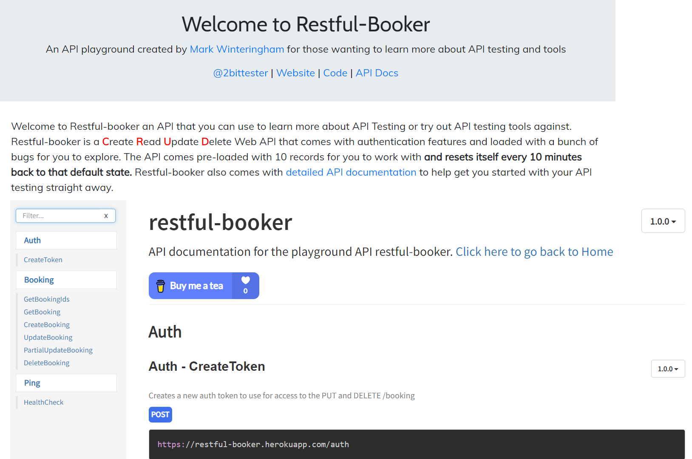

# Restful Booker Python API Tests

This project contains automated API tests for the Restful Booker service using Python.



## Purpose

The purpose of this project is to showcase how to automate API tests for the Restful Booker service. The tests are written in Python using the `pytest` framework and utilize the `requests` library for making HTTP requests. Docker is used to provide a consistent environment for running the tests. Additionally, two reporting tools, Allure and `pytest-html`, are integrated to provide detailed test reports.

## Tech Stack and Dependencies

- Python
- `pytest`
- `requests`
- Docker
- Allure for reporting
- `pytest-html` for additional reporting

## How to Run the Tests

1. Install Python on your machine.
2. Clone this repository.
3. Navigate to the project directory in the terminal.

### Running Tests Locally

1. Install project dependencies:
```
pip install -r requirements.txt
```

2. Run the tests with Allure reporting:
```
pytest --alluredir=allure-results test_auth.py
```

2.1. Run the tests with pytest-html reporting:
```
pytest --html=reports/report.html test_auth.py
```

2.2. Run the tests with both Allure and HTML reports:
```
pytest --alluredir=./allure-results --html=./reports/report.html
```
This command specifies the directory for Allure results and the file path for the HTML report. It will run your tests and generate both types of reports.

### Details about Allure Reporting and how to see html report for it

This project utilizes Allure reporting to provide comprehensive and visually appealing test reports.

#### Installation

Before using Allure reporting, you need to have the Allure command-line tool installed on your machine. You can follow the installation instructions provided on the Allure website: [Allure Installation Guide](https://docs.qameta.io/allure/#_installing_a_commandline)

#### Generating Allure Report

1. After running your tests, Allure results will be generated automatically. These results are stored in the `allure-results` directory.

2. To generate an Allure report from the results, open a terminal and navigate to your project directory.

3. Run the following command to generate the Allure report:
```
allure generate allure-results -o allure-report --clean
```

#### Viewing the Allure Report

1. Once the report is generated, you can view it using the Allure command-line tool. Run the following command:
```
allure open allure-report
```

2. This will open the Allure report in your default web browser. The report provides detailed insights into your test execution, including steps, attachments, assertions, and more. You can explore the report to analyze the results visually.

#### Cleaning Up

You can clean up the generated Allure results and report directories if needed. Simply delete the `allure-results` and `allure-report` directories from your project.


### Running Tests with Docker

1. Install Docker on your machine.

2. Make sure that Docker is running.

3. Build the Docker image:
```
docker-compose build
```

4. Run the tests in a Docker container:
```
docker-compose up
```

## Purpose of Test Files

- `test_auth.py`: Contains a test case to authenticate and check the success of the authentication.
- `test_data.py`: Contains test data such as authentication credentials and base URLs.

This project aims to provide a beginner-friendly guide for automating API tests and generating comprehensive test reports using Allure and pytest-html. Follow the steps above to execute the tests, generate reports, and analyze the test results visually.
